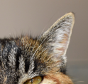
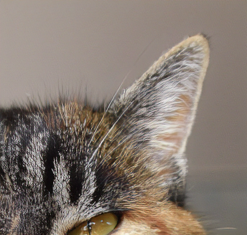
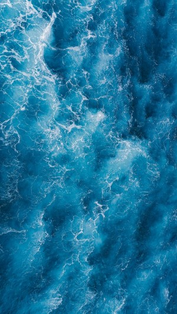
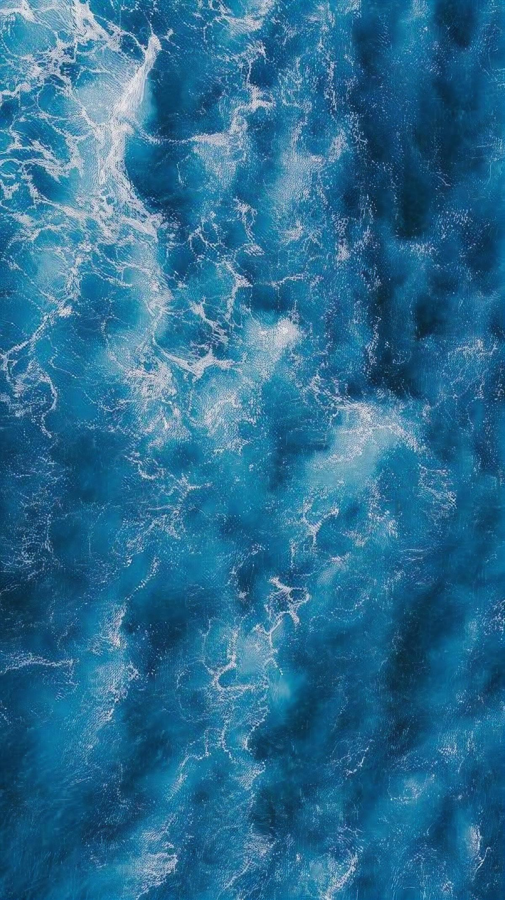
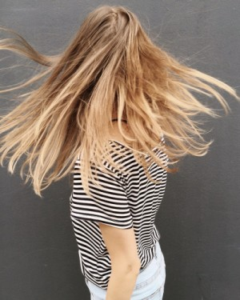
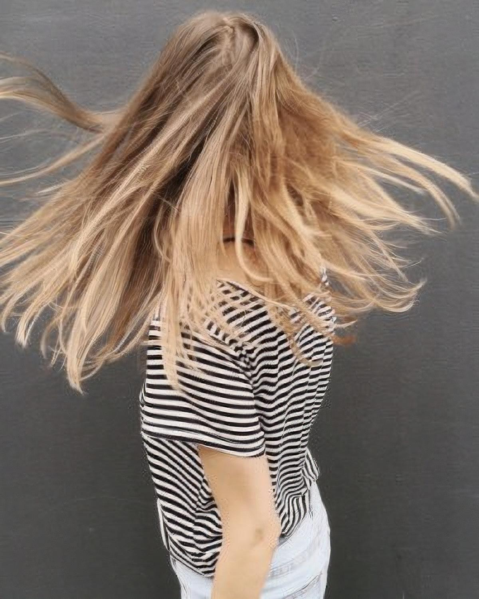
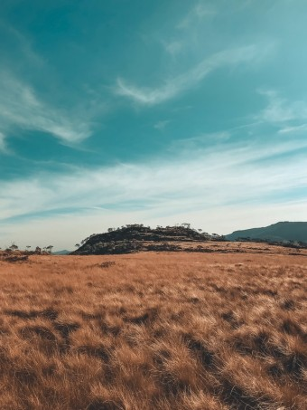
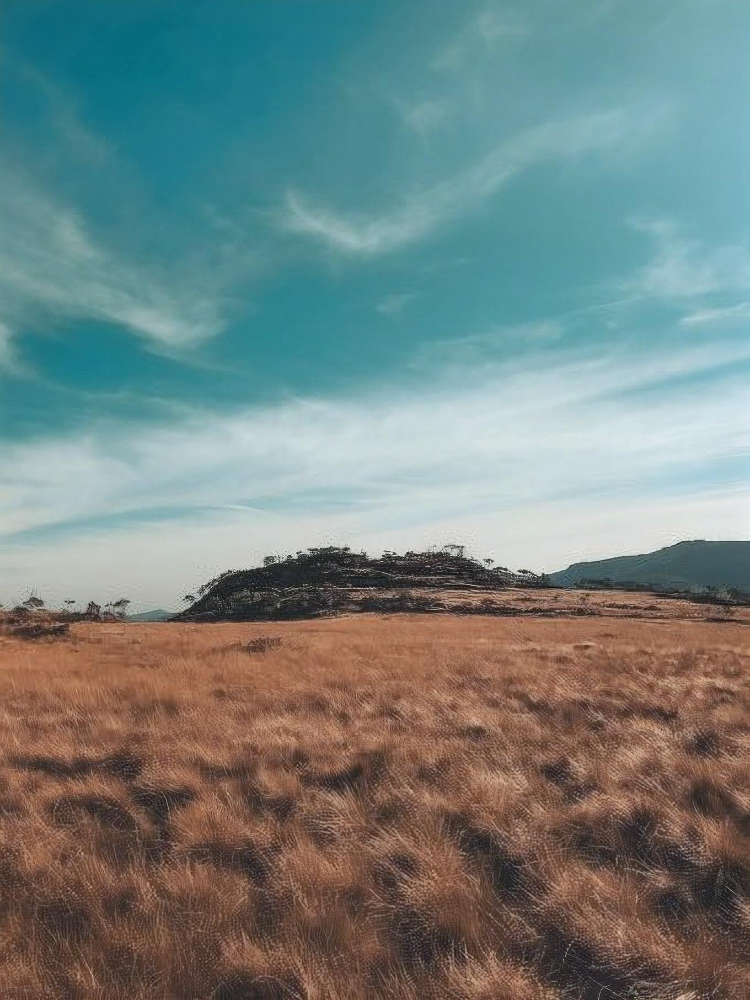

# image-resolution-enhancer

## About sr-gan:
SRGAN is a generative adversarial network for single image super-resolution. It uses a perceptual loss function which consists of an adversarial loss and a content loss. The adversarial loss pushes the solution to the natural image manifold using a discriminator network that is trained to differentiate between the super-resolved images and original photo-realistic images. find more here :[https://arxiv.org/abs/1609.04802v5]

## How to use:
open image, upscale then save to file

## Results :

 

 

 

 